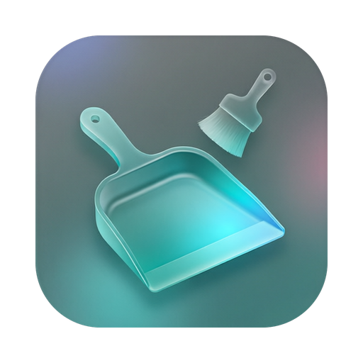
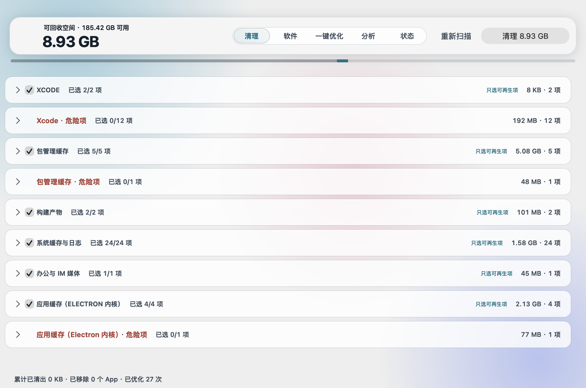
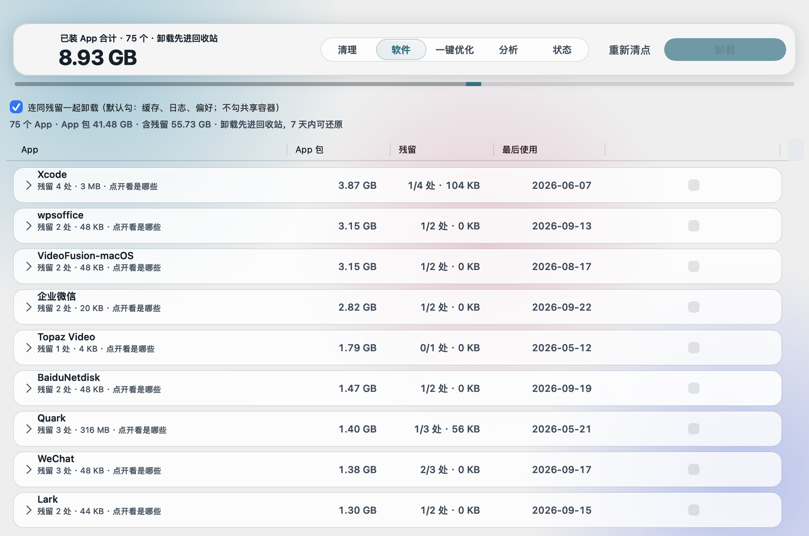
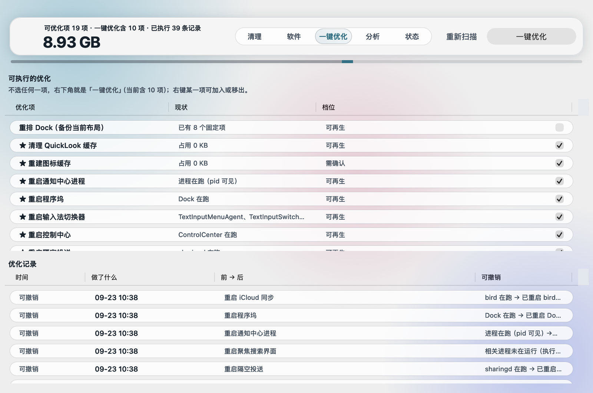
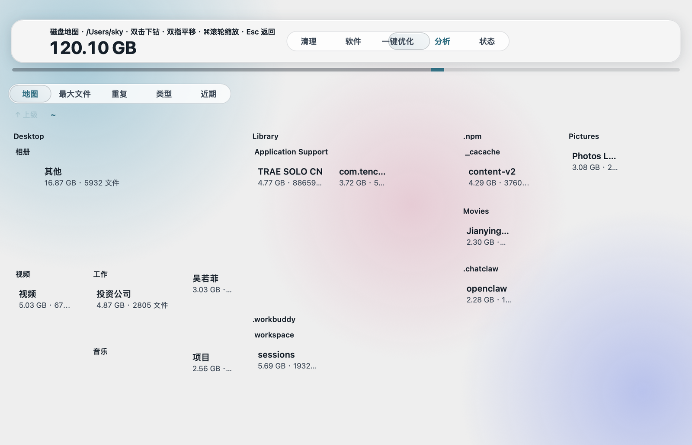
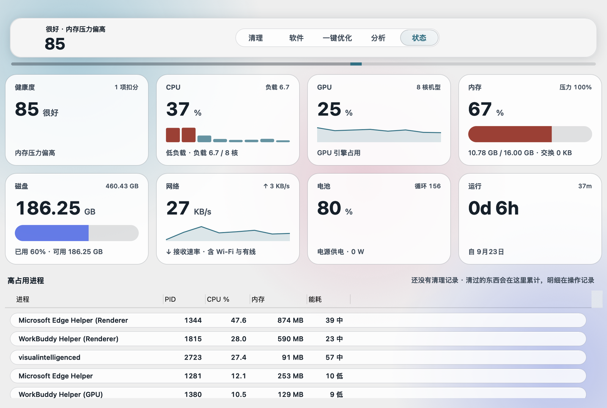
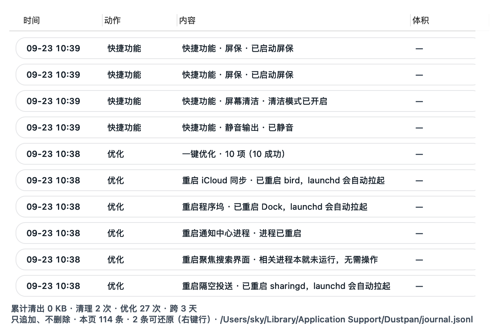
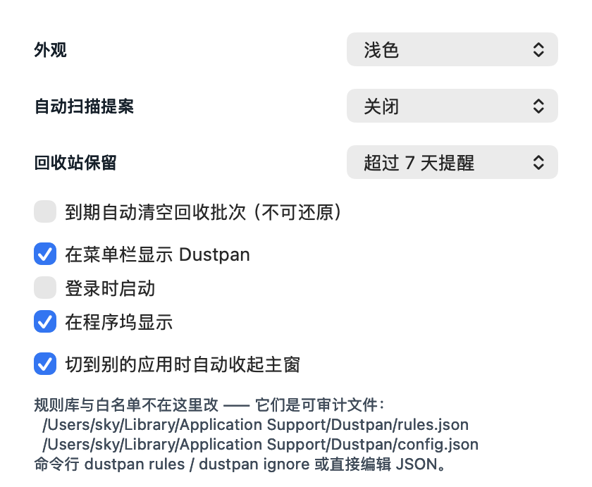

<div align="center">



# Dustpan

**可审计的 macOS 空间清理工具**

所有删除先进回收站 · 7 天内一键还原

<br>

### ⬇️ [**下载最新版 Dustpan**](https://github.com/anson55sky/Dustpan/releases/latest)

`https://github.com/anson55sky/Dustpan/releases/latest`

<br>

[](https://github.com/anson55sky/Dustpan/releases/latest)
[](https://github.com/anson55sky/Dustpan/releases)
[](#系统要求)
[](#版权与授权)

</div>

---

> ### ⚠️ 本仓库没有任何源代码
>
> Dustpan 是**闭源商业软件**，源码在私有仓库中维护。这里只有项目介绍、界面截图、
> 更新日志与安装包 —— **请不要在这里寻找、索取或请求提供源码**，找不到是正常的，不是漏传。

---

## 目录

[项目简介](#项目简介) · [核心功能](#核心功能) · [系统要求](#系统要求) · [安装教程](#安装教程) · [使用说明](#使用说明) · [常见问题](#常见问题) · [更新日志](#更新日志) · [版权与授权](#版权与授权)

---

## 项目简介

macOS 上的清理工具，大多让你「点一下，然后相信它」。

Dustpan 的立场正好相反 —— **每一次删除都留证据，每一次删除都能撤销。**

| | Dustpan 的做法 |
|---|---|
| **不直接删** | 任何删除先移进 `~/Library/Application Support/Dustpan/Trash/<批次>/`，**7 天内可还原**，按批次整体撤销 |
| **不静默** | 每个动作都追加进一份**只增不删**的 JSONL 流水账：什么时候、动了什么、多少字节、能不能还原 |
| **不替你决定** | 危险项默认**永不勾选**；系统目录走白名单；用户数据有专门的拒绝闸（保护列表） |
| **不假装** | 读不到就说读不到，能力不足就降级；绝不会编一个「已清理 3.2 GB」给你 |

它用 **纯原生 AppKit + Metal 自绘**实现 —— 没有 Electron，没有前端运行时，安装包约 6 MB，
启动不拉任何网络请求。

---

## 核心功能

### 清理 · 空间提案，按档位分组



- 扫描后把可清理项按**类型分组**呈现：Xcode、包管理缓存、构建产物、系统缓存与日志、应用缓存、办公与 IM 媒体……
- 每组标一个**档位**，你一眼就知道能不能闭着眼睛勾：

  | 档位 | 含义 |
  |---|---|
  | `可放心清理` | 可再生内容，删了会被重新生成 |
  | `需逐项确认` | 有副作用或用处，建议看一遍再决定 |
  | `危险` | **默认永不勾选**，只展示、需手动介入 |

- 每组的「只选可再生项」一键把该组的安全项勾上。
- 顶栏那个大数字是**本次勾选项的合计**，不是「扫描到了多少」—— 你勾多少它显示多少。
- 清理 = 移入回收站，随时按批次还原。

### 软件 · 卸载 App 与它的残留



- 列出已装 App 的体积、**残留项数量**与最后使用日期。
- 「连同残留一起卸载」：App 包与它的缓存、日志、偏好、容器一起进回收站，而不是只把图标拖进废纸篓留一地尾巴。
- 残留可以逐项展开看看到底是哪些文件，再决定动不动。
- 卸载同样可还原 —— 批量卸载错了一个，整批撤销。

### 一键优化 · 可执行项 + 可撤销记录



一串「重启一下就好」的系统小毛病：重启程序坞 / 输入法 / 通知中心 / 控制中心 / 聚焦 / 隔空投送 / iCloud 同步、重建图标缓存、清理 QuickLook 缓存……

- 每条都带**现状**与**档位**，不靠猜。
- 跑完写进**优化记录**，标着「可撤销」—— 需要时能回到改动前的状态。
- 也支持定时提案：到了日子提醒你跑一遍，而不是偷偷在后台动你的系统。

### 分析 · 磁盘地图



- 整盘 / 指定目录的**可视化瓦片图**：方块面积就是体积，双击下钻、双指平移、⌘滚轮缩放、Esc 返回上一层。
- 另有四个并列视图：**最大文件**、**重复文件**（按内容比对，不是按文件名）、**类型**、**近期新增**。

### 状态 · 这台机器现在怎么样



- **健康度评分** + 扣分项，一眼看出哪里不对（内存压力、磁盘余量、负载……）。
- CPU / GPU / 内存压力 / 磁盘 / 网络速率 / 电池循环 / 运行时长。
- **高占用进程**可直接结束：SIGTERM（给它机会正常退出）与强制结束（SIGKILL，明确告诉你不可撤销）分开，副作用写清楚再动手。
- **运行诊断**：完全磁盘访问到位没、路径为什么读不到、缓存命中情况、规则库有没有被拒、更新渠道是否可达 —— 出问题的时候，先看这一页。

### 菜单栏 · 常用开关随手点


点菜单栏图标弹出一块面板，上半是状态卡（可用空间、健康度、CPU / 内存），下半是宫格：

保持亮屏 · 隐藏程序坞 · 隐藏桌面图标 · 显示隐藏文件 · 显示扩展名 · 静音输出 · 屏幕清洁 · 键盘清洁 · 一键优化 · 一键清理 · 清空剪贴板 · 清空废纸篓 · 推出磁盘 · 屏保 · 屏幕休眠 · 释放内存

- **磁贴可自定义增删**，只留你常用的。
- 「一键优化」「一键清理」**不打开 App**，直接在后台跑默认勾选项。
- 面板顶部那张卡记录你累计清掉多少、移除几个 App、优化几次、还原几次。

### 操作记录 · 只追加、不删除



- 每一次清理、卸载、优化、撤销、还原、清空都在这里，**一条不少、一条不删**。
- 落在 `~/Library/Application Support/Dustpan/journal.jsonl` —— 标准 JSONL，你可以直接 `grep`、`jq`、拽进表格里审。**审计不靠我们提供一个界面，靠文件本身**。
- 能还原的行右键就能还原。

### 设置



- **外观**：跟随系统 / 浅色 / 深色。
- **自动扫描提案**：关闭 / 每天 / 每 3 天 / 每周。
- **回收站保留**：超过 7 / 14 / 30 天提醒；到期自动清空需要**二次强确认**（不可还原，所以不让你顺手打开）。
- 在菜单栏显示、登录时启动、在程序坞显示、切到别的应用时自动收起主窗。
- **规则库与白名单不放在设置界面里改** —— 它们是可审计的 JSON 文件（`rules.json` / `config.json`），你可以直接读、直接改、直接 diff。

### 命令行

清理引擎与界面同源，命令行只输出计划、不做全盘递归，速度快到适合塞进脚本：

```
dustpan scan      扫描并报告可清理项（只读）
dustpan clean     清理计划；加 --apply 才移入回收站
dustpan undo      还原批次
dustpan batches   列出回收站批次
dustpan analyze   最大文件 / 按类型 / 重复 / 近期新增
dustpan tree      目录体积树（磁盘地图的数据层）
dustpan apps      已装 App 清单与体积（--residuals 看残留）
dustpan rules     查看 / 导出 / 校验规则库
dustpan ignore    白名单：list / add / remove
dustpan settings  读写设置（与界面同一份 settings.json）
```

> 命令行版本目前**不随 dmg 分发**，如有需要请通过下游渠道反馈。

---

## 系统要求

| 项目 | 要求 |
|---|---|
| **操作系统** | macOS 13.0 Ventura 或更高 |
| **处理器** | Apple 芯片（M 系列）与 Intel **均支持**（通用二进制） |
| **安装体积** | 约 6 MB |
| **磁盘访问** | 建议授予**「完全磁盘访问权限」**，否则部分系统目录读不到、扫描结果会偏小 |
| **其他权限** | 不需要管理员密码，不安装驱动或内核扩展，不修改系统外观 |
| **网络** | 只有「检查更新」会访问一次公开的版本清单；不联网也能完整使用 |

---

## 安装教程

**1. 下载**

点顶部那个下载按钮，或访问 → <https://github.com/anson55sky/Dustpan/releases/latest>

在 **Assets** 里选 `Dustpan-<版本号>.dmg` 下载。

**2. 装载**

双击 `.dmg`，把 **Dustpan** 拖进「应用程序」。

**3. 首次打开被拦下？这是预期行为**

安装包目前是 **ad-hoc 签名、未经过 Apple 公证**，所以首次打开 macOS 会拦一下 ——
不是包坏了。放行方式二选一：

- 在「访达」里**右键 App →「打开」**，再点一次「打开」；
- 或者执行一次：

  ```sh
  xattr -dr com.apple.quarantine /Applications/Dustpan.app
  ```

**4. 授予「完全磁盘访问权限」（推荐）**

`系统设置 → 隐私与安全性 → 完全磁盘访问权限` → 把 **Dustpan** 打开，然后重启 App。

没有这项权限也能用，但系统目录（如 `~/Library` 下的部分区域）读不到，
「可回收空间」会比真实值偏小。Dustpan 宁可报小也不会瞎猜 —— 状态页会直接告诉你是哪一种。

**5. 校验下载完整（可选）**

```sh
shasum -a 256 ~/Downloads/Dustpan-*.dmg
# 与对应 Release 说明里给出的 SHA-256 比对
```

---

## 使用说明

第一次用，照这个顺序走一遍就够了：

1. **打开 App → 清理页 → 等扫描完成。**
   浅扫靠尺寸缓存，通常几秒；首次全量会久一些。
2. **先看档位，再勾选。**
   标着 `危险` 的分组一个字都不用管，它本来就不勾。用每组右边的「只选可再生项」快速把安全项选上。
3. **点右下角「清理」。**
   勾了 8.93 GB 它写 8.93 GB；实际移走的内容会一条条记进操作记录。
4. **想反悔就撤销。**
   清理页或操作记录里都能按批次还原，7 天内有效。
5. **换上自己的习惯。**
   零碎开关去菜单栏宫格点；根目录占空间去「分析」页钻；系统发烫发卡去「状态」页看是谁在吃 CPU。

**几个要点：**

- **它不会主动打扰你。** 除你手动打开主界面外，菜单栏图标、宫格、设置、通知都不会把主窗顶出来。
- **「危险」不是装饰。** 那些项需要你手动点开分组、逐个确认 —— 这是有意的摩擦。
- **到期自动清空默认关闭。** 开着它就真的不可还原了，所以打开时要你确认一遍。
- **数据都在你自己机器上。** 没有账号、没有云端、没有遥测。

### 关于更新

Dustpan 内置更新机制，启动时读一次公开的版本清单（`appcast.json`）：

- **普通新版本**只提示一次，随时可以「以后再说」；
- **必须更新**（数据格式不兼容、安全修复这类「不更新就会出问题」的情况）会弹出一个
  **关不掉的窗** —— 只有「立即更新」和「退出 Dustpan」两个选择；
- **断网、清单读不到，一律不打扰你。** 把「不知道有没有新版」当成「必须更新」，
  等于让人一断网就打不开工具；
- 下载完会**先校验 SHA-256**，对不上就判为坏包、不写回下载目录、不反复重下。


---

## 常见问题

**Q：为什么没有源代码？不是说 GitHub 上开源吗？**
Dustpan 是**闭源商业软件**。这个仓库是产品页与下载入口，不是代码仓库。
源码在私有仓库维护，不公开、不授权、不提供。请不要开 Issue 索取源码。

**Q：会不会误删我的文件？**
三道闸挡着：① 所有删除都先进 Dustpan 自己的回收站，7 天内可还原；② `危险` 档位的项默认永不勾选；
③ 系统目录走白名单，用户数据目录有一份单独的拒绝闸，命中直接跳过。
即便如此 —— 清理前看一眼再点，永远是对的。

**Q：点了「清理」，文件到底去哪了？**
去 `~/Library/Application Support/Dustpan/Trash/<批次>/`，原路径信息完整保留。
7 天内可以原样还原；原位置被占用时它会告诉你，不会静默覆盖。

**Q：扫描出来的可清理空间比别的工具少，是不是不行？**
多半是**没给「完全磁盘访问权限」**，部分系统目录读不到，宁可报小也没瞎估。
去状态页 →「运行诊断」看「完全磁盘访问」那一行；它会明确告诉你扫描结果是完整还是偏小。

**Q：为什么首次打开被系统拦下？**
包是 ad-hoc 签名、未公证，见上面[安装教程](#安装教程)第 3 步的放行方式。

**Q：支持 Intel 的 Mac 吗？**
支持。安装包是 arm64 + x86_64 的通用二进制。

**Q：需要一直开着吗？**
不需要。想用再开，菜单栏图标也可以在设置里关掉。

**Q：有遥测吗？会上传我的文件列表吗？**
没有遥测，不上传任何数据、不发设备标识。
唯一的外部请求是「检查更新」时对公开版本清单的一次 `GET`，不带查询参数、不带用户标识。
清单地址可以在「运行诊断」里直接看到。

**Q：怎么卸载 Dustpan？**
把 `/Applications/Dustpan.app` 拖进废纸篓。
数据在 `~/Library/Application Support/Dustpan/`（回收站批次、流水账、规则），想彻底清干净一并删掉即可。

**Q：装新版要不要先卸载旧版？**
不用。下载新 dmg，把 Dustpan 拖进「应用程序」覆盖即可，设置与操作记录都保留。

---

## 更新日志

### 0.15.11 · 2026-09-23

- 更新渠道迁移：下载页改用新地址（仓库改名为 `Dustpan`），应用内的更新检查地址同步指向新地址。
- 旧地址仍会重定向到新地址，从 0.15.6 及更早版本升级不受影响。
- 功能与 0.15.10 完全一致，本次仅包含更新渠道迁移。

### 0.15.10 · 2026-09-23

- 程序坞显示开关重做：形态改为**启动前确定**。关闭「在程序坞显示」后不再残留一直跳动的图标。
- 修正上一版在勾选态下偶发的形态不一致。

### 0.15.9 · 2026-09-23

- 修复：勾选「在程序坞显示」后**整条菜单栏消失**（连 Apple 标志、Wi‑Fi、电量、时钟都不显示）。
- 现在无论显示或隐藏程序坞图标，菜单栏始终正常。

### 0.15.7 · 2026-09-23

- 首次打开 App 直接显示主界面。
- 菜单栏宫格新增「键盘清洁」「一键优化」「一键清理」；去掉「更多…」折叠，启用项全部直接摆出来。
- 设置新增「在程序坞显示」。
- 除主动点击外，任何入口都不再自动弹出主窗。

### 0.15.6 · 2026-09-22

- **新增强制更新机制**：启动读取公开版本清单，需要时弹出不可关闭的更新窗，自动下载并校验 SHA-256 后再打开。
- 残留巡检、定时提案、回收站到期提醒改用**系统通知**，不再打断你手上的操作。
- 新增 `dustpan settings` 命令行入口，与界面共用同一份配置。
- 修复：深色模式下多处文字取色遗漏；宫格 5 个动作失效（显示扩展名、隐藏桌面图标、截图授权、屏保、清空废纸篓）。

### 0.15.5 · 2026-09-21

- 修掉启动期一条 AppKit 约束越界警告。

### 0.15.3 · 2026-09-21

- 设置里选「深色 / 浅色」能真正压过系统外观，菜单栏面板同步生效。

### 0.15.2 · 2026-09-21

- 五项界面修复：深色模式首启顶栏取色、宫格取色、设置窗层级、切走应用自动收起、宫格需要点两次才关。

### 0.15.1 · 2026-09-21

- 修复列表排序失效；状态页补充能耗信息。

### 0.15.0 · 2026-09-21

- 勾选回弹、首次点击即收起、颜色切换时机。

> 更早的版本见 [Releases](https://github.com/anson55sky/Dustpan/releases)。

---

## 版权与授权

**Dustpan 是闭源商业软件。版权所有 © 2026 anson55sky，保留所有权利。**

- **不开放源代码**，不提供源码，不授权二次开发。
- **禁止**任何形式的逆向工程、反编译、反汇编、脱壳或提取内部实现。
- **禁止**修改、改名、重新打包、去除签名或版权标识后再分发。
- **禁止**未经许可的二次分发、转售、捆绑、镜像托管（包括上传到其它网盘、软件站、包管理器仓库）。
- 本仓库的**文字与截图**同样受版权保护，未获书面许可不得转载用于商业用途。

**允许：**

- 在个人设备上安装与使用 Dustpan。
- 出于分享目的，**转载本页链接**（而不是安装包文件本身）。
- 在评测、教程中引用截图，注明出处即可。

安装包按「原样」提供。清理操作有回收站与流水账兜底，但仍请自行确认要删的内容。

---

<div align="center">

**[⬇️ 下载最新版](https://github.com/anson55sky/Dustpan/releases/latest)**

<sub>本仓库只放介绍、截图与更新日志 · 安装包在 <a href="https://github.com/anson55sky/Dustpan/releases">Releases</a> 附件中 · 无源代码</sub>

</div>
