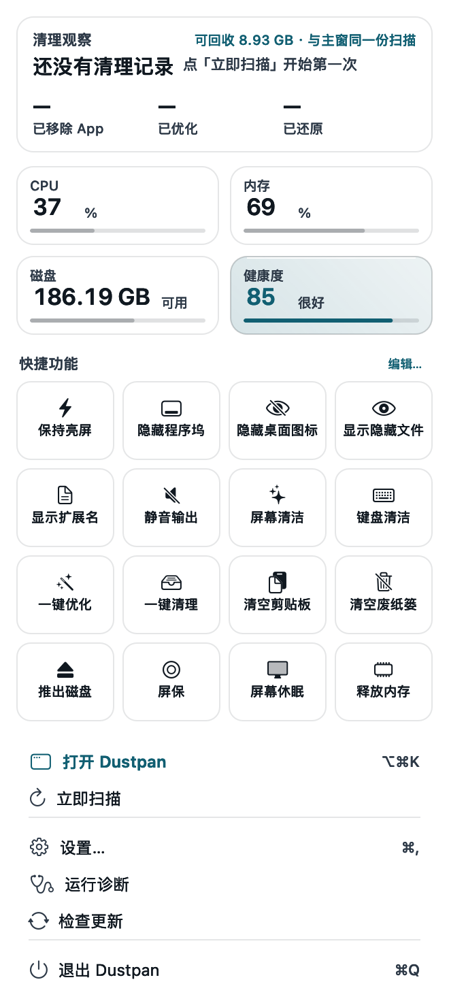
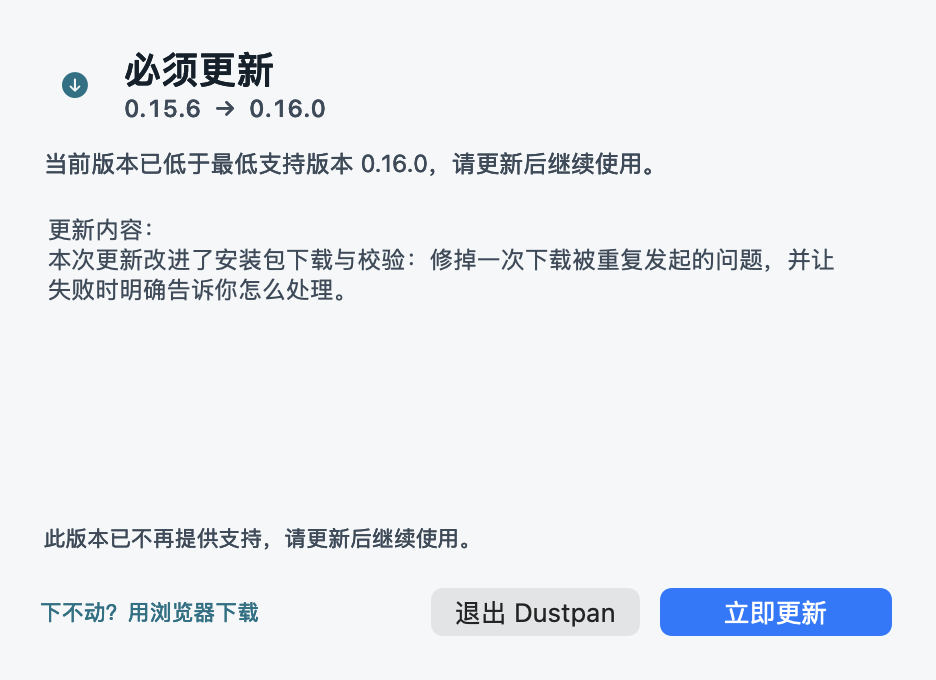

# Dustpan

**可审计的 macOS 空间清理工具。所有删除先进回收站，7 天内可一键还原。**

[](#系统要求)
[](../../releases/latest)
[](../../releases)

> 这个仓库**只放安装包与版本清单**。源码不开源，在私有仓库里维护。

---

## 下载

**→ [下载最新版 Dustpan](../../releases/latest)**

安装包是 `.dmg`，双击打开后把 Dustpan 拖进「应用程序」即可。

每个 Release 都附带 `appcast.json`（版本清单）与 SHA-256 校验值。

---

## 它解决什么问题

macOS 上的清理工具大多让你"点一下，然后相信它"。Dustpan 的立场相反：
**每一次删除都留证据，每一次删除都能撤销。**

| | Dustpan 的做法 |
|---|---|
| **不直接删** | 任何删除都先移进 `~/Library/Application Support/Dustpan/Trash/<批次>/`，**7 天内可还原** |
| **不静默** | 每个动作追加进 JSONL 流水账：什么时候、动了什么、多少字节、能不能还原 |
| **不替你决定** | 危险项（档位 `blocked`）**永不默认勾选**；系统目录走白名单；用户数据有专门的拒绝闸 |
| **不假装** | 扫描结果读不到就说读不到；能力不足就降级，绝不编一个"已清理 3.2GB"给你 |

---

## 功能

- **全盘扫描**：按类型 / 体积归类，一级一级看到底是什么在占空间
- **磁盘地图**：整盘空间的可视化瓦片图，点着进去看
- **回收站与还原**：按批次还原，原位置被占用时会告诉你，不会静默覆盖
- **应用卸载**：把 App 与它的残留一起找出来
- **一键优化**：常用开关做成菜单栏宫格，随手点
- **操作记录**：一张只追加、不删除的流水表
- **诊断**：把"为什么读不到某个目录"这类问题直接说清楚

## 界面




---

## 系统要求

- **macOS 13.0 或更高**
- Apple 芯片与 Intel 均支持（通用二进制）

## 首次打开被拦下？

当前安装包是 **ad-hoc 签名、未经过 Apple 公证**，所以首次打开 macOS 会拦一下。
这是预期行为，不是安装包坏了 —— 放行方式二选一：

1. 在「访达」里**右键 App →「打开」**，再点一次「打开」；
2. 或者执行一次：

   ```sh
   xattr -dr com.apple.quarantine /Applications/Dustpan.app
   ```

校验下载是否完整（可选）：

```sh
shasum -a 256 ~/Downloads/Dustpan-*.dmg
# 与 Release 说明里给出的 SHA-256 比对
```

---

## 关于更新

Dustpan 内置强制更新机制：启动时读一次公开的版本清单（`appcast.json`）。

- 清单里标了 `force`，或你的版本低于 `minVersion`，会弹出一个**关不掉的更新窗**，
  只有「立即更新」和「退出 Dustpan」两个选择 —— 这用于数据格式不兼容或安全修复这类
  "不更新就会出问题"的情况；
- 普通的新版本只会提示一次，随时可以「以后再说」；
- **断网、清单读不到，一律不打扰你**。把"不知道有没有新版"当成"必须更新"，
  等于让人一断网就打不开工具。

需要强制更新时是这个样子 —— 窗关不掉，也没有「以后再说」：



### 隐私

App **不收集任何数据，也没有遥测**。唯一的外部请求是启动时对版本清单的一次 `GET`：
不带查询参数、不带用户标识、不带设备信息。清单地址编译在二进制里，
你也可以在「运行诊断」里直接看到它。

---

## 版本历史

见 [Releases](../../releases)。

---

## 授权与说明

- 本项目**不开源**，源码在私有仓库中维护。
- 本仓库（`Dustpan-Releases`）仅用于发布安装包、版本清单与项目介绍。
- 安装包按原样提供。清理操作虽然有回收站与流水账兜底，仍请自行确认要删的内容。
